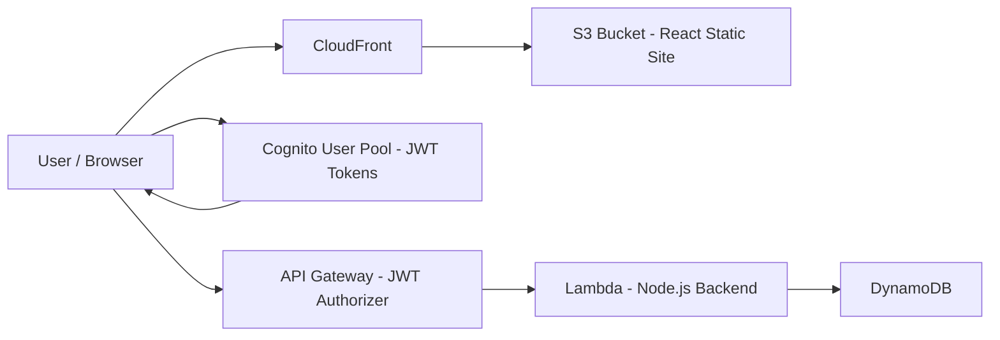

# job-tracker-serverless

**Current status:** POC in progress

A production-style serverless web application built with React, AWS CDK, and AWS managed services to track job applications and application status.

---

## Architecture



---

## Tech Stack

- Frontend: React + TypeScript
- Infrastructure: AWS CDK (TypeScript)
- Hosting: S3 + CloudFront
- Authentication: Cognito User Pools (JWT)
- API: API Gateway (HTTP API)
- Compute: AWS Lambda (Node.js)
- Database: DynamoDB  

---

## Local Development

### Backend

```bash
cd backend
npm install
npm run dev
```

Runs on: http://localhost:3001

### Frontend

```bash
cd frontend
npm install
npm run dev
```

Runs on: http://localhost:5173

---

## Current Progress

- [ ] CDK project initialized
- [ ] API Gateway + Lambda deployed
- [ ] DynamoDB table created
- [x] React app scaffolded
- [x] Frontend connected to backend
- [ ] Cognito authentication integrated
- [ ] Deployed to CloudFront

---

## Tech Debt / Suggestions

- `appliedDate` is only checked as a string; consider validating/parsing it (e.g., ISO date) to avoid inconsistent formats.
- Replace `DEMO_USER_ID` with an authenticated user id when integrating auth.
- Use a validation library (zod/joi) or request DTOs for clearer and more maintainable input validation.
- If the store becomes async (real DB), make handlers async and await persistence; also consider returning a `Location` header for the new resource.
- Consider an environment variable for the port (e.g., `process.env.PORT ?? 3001`), tighten CORS for production, add request-logging and error-handling middleware, and implement graceful shutdown for the server.
